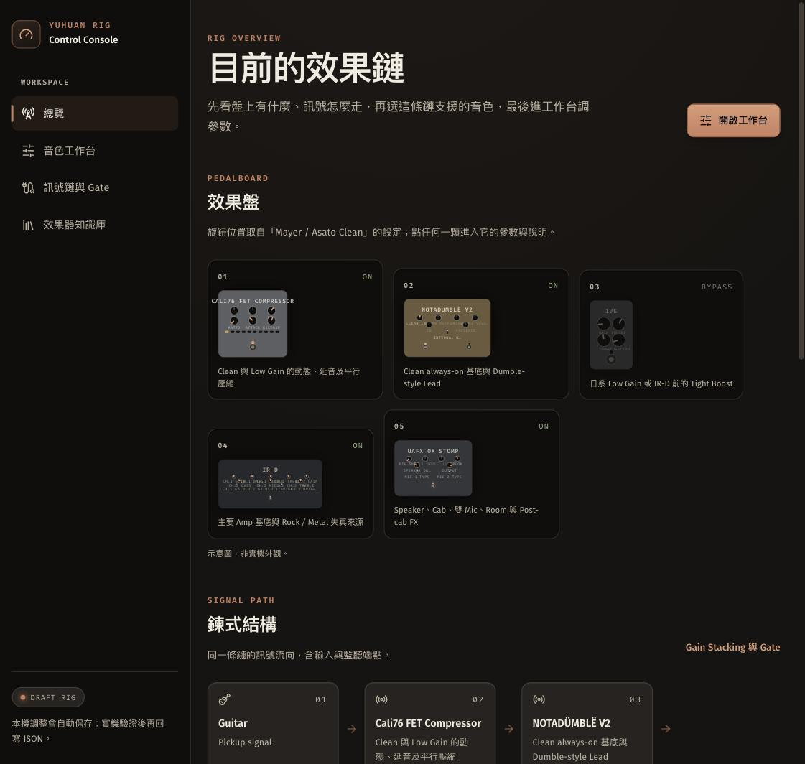

# Guitar Tone Rig

一副吉他效果鏈的知識庫，做成可以互動的樣子。訊號怎麼走、每一級在做什麼、每組音色的旋鈕停在哪裡——全部從 JSON 產生，包括畫面上那些效果器示意圖。

**線上版：<https://yuhuan183.github.io/guitar-tone-rig/>**（純靜態，不需要帳號，關掉分頁不留任何東西在伺服器上）



## 這是什麼

調音色最麻煩的不是不知道旋鈕要轉去哪，而是「上次調到哪、為什麼那樣調」散在筆記、截圖和記憶裡。這個專案把那份知識收進 `data/` 的四份 JSON，介面只是它的一種讀法：

- **效果盤與訊號鏈**——五級效果器加輸入與監聽端點，每一顆都是進到它參數頁的入口。
- **音色工作台**——選一組音色，逐級調參數。旋鈕角度是該音色的實際設定值，不是裝飾。
- **效果器頁**——調節取向、Troubleshooting、每個控制項的說明、信心邊界，以及原廠資料來源。
- **匯出回 JSON**——瀏覽器裡的試調整理成 Before／After，產生可以直接貼回 `data/rig.json` 的區塊。試調過的值一律標記 `needs-calibration`：在瀏覽器裡調過，不等於用耳朵確認過。

微調只存在你自己的瀏覽器（localStorage），不會改動 repo 裡的 JSON，也不會送到任何地方。

## 效果器示意圖是資料畫出來的

盤上那些效果器是 **SVG 示意圖，不是產品照片**，每一顆都從 `data/devices.json` 產生：

- 控制項的 `surface`（`panel` / `software` / `derived`）決定它畫不畫在機殼上，`PANEL_SHAPES` 決定它畫成旋鈕、撥桿、腳踏開關還是 LED 表頭。兩邊對不起來 `npm run check` 會擋。
- 旋鈕角度取自目前音色的實際值，切換音色會轉過去，拖曳時即時跟著動。
- 這組音色沒指定的控制項畫成暗色，不會停在正中央假裝有值。

選示意圖而不是照片的理由就在這裡：資料改了，圖不可能不跟著改。

## 快速開始

```sh
git clone https://github.com/Yuhuan183/guitar-tone-rig.git
cd guitar-tone-rig
npm install
npm run dev
```

Port 不寫死。`scripts/pick-port.mjs` 以專案路徑的 hash 在 **20000–39999** 取一個基準 port，再實際 bind 測試：同一個 checkout 每次都是同一個 port（書籤不會失效），不同 checkout 不會互撞，已被占用的會往上跳過。要指定就 `PORT=3000 npm run dev` 或 `PREVIEW_PORT=4000 npm run preview`；啟動時 Vite 會印出實際位址。

## 頁面

| 路徑            | 用途                                                                             |
| --------------- | -------------------------------------------------------------------------------- |
| `/`             | 現在載入哪一組音色、訊號鏈長什麼樣。鏈上每一級就是效果器的入口。                 |
| `/presets`      | 音色工作台：選音色 → 選一級 → 調參數 → 匯出回 JSON。                             |
| `/signal-chain` | Gain Stacking、Gate 拓樸、電源與接地、安全規則，以及暫時不放進鏈上的 Gain。      |
| `/devices/:id`  | 單一效果器的參數、調節取向、診斷、信心邊界與原廠來源；底部可直接走到前／後一級。 |

## 資料是唯一的來源

`schemas/` 的 JSON Schema 2020-12 是契約，型別由它產生，內容由它驗證：

| 路徑                      | 內容                                                             |
| ------------------------- | ---------------------------------------------------------------- |
| `data/devices.json`       | 效果器、面板區塊（`sections`）、控制項、值型別、範圍與調節方向。 |
| `data/rig.json`           | 訊號鏈、路由、安全規則、共用基準與五組音色 Preset。              |
| `data/device-guides.json` | 各效果器的調節取向、Troubleshooting、控制項說明與原廠資料來源。  |
| `data/tuning-log.json`    | 實機調教紀錄。                                                   |
| `schemas/`                | JSON Schema 2020-12，是型別與驗證的唯一契約。                    |
| `src/types.generated.ts`  | 由 `schemas/` 產生，請勿手改。                                   |

`npm run validate:data` 不只跑 schema，也檢查 schema 表達不了的東西：這個 `controlId` 在那台機器上存在嗎、每個 category 都有標籤嗎、同一個 URL 有沒有出現在兩個地方。

## 想動手改

1. **效果器新增控制項**：改 `data/devices.json`，並確認它的 `section` 已在該效果器的 `sections` 宣告。
2. **音色改值**：改 `data/rig.json`。
3. **器材知識**（原則、Troubleshooting、控制項說明、互動儀表）：改 `data/device-guides.json`，不要寫進 React 元件。
4. **改了 `schemas/`**：接著跑 `npm run generate:types`。
5. **實機測試**：先記進 `data/tuning-log.json`。只在聽感穩定且測試條件完整時，才把 Setting 或 Preset 標記為 `verified`。
6. **送出前**：`npm run check`。

看合併後的完整 Preset：

```sh
node scripts/show-preset.mjs mayer-asato-clean
```

## 技術與檢查

React 19 + TypeScript + Vite，Tailwind CSS v4，Zustand（只存瀏覽器內的試調值），Hash Router。字型自 host（`@fontsource`），沒有任何第三方請求——沒有分析工具、沒有 CDN、沒有 runtime fetch，資料在 build 時就進了 bundle。

模組分層與相依方向見 [`docs/architecture.md`](docs/architecture.md)：`src/lib/` 的領域邏輯全部把資料當參數收，只有 `lib/data.ts` 碰 JSON，`lib/rig.ts` 是唯一組裝點，所以測試直接測純模組，不必載入真實 rig。

所有隨視窗寬度變化的值集中在 `src/lib/responsive.ts`，一個 scale 只宣告「在哪個視窗寬度該是多少」，`clamp()` 由 `npm run generate:responsive` 算出來，不是手調 `vw` 係數。

`npm run check` 依序跑下面這些；CI（`.github/workflows/check.yml`）與部署（`.github/workflows/deploy.yml`）跑同一組，紅的 `main` 不會上線：

| 指令                         | 檢查內容                                                                                             |
| ---------------------------- | ---------------------------------------------------------------------------------------------------- |
| `npm run validate:data`      | 以 ajv 對 `schemas/` 實際驗證四份文件，再檢查跨文件參照（controlId、section、category、preset 等）。 |
| `npm run validate:generated` | `src/types.generated.ts` 與 `schemas/` 是否同步、`data/` 格式是否符合 `format-data`。                |
| `npm run typecheck`          | `tsc -b`。                                                                                           |
| `npm run lint`               | ESLint（含 react-hooks）。                                                                           |
| `npm run format:check`       | Prettier。                                                                                           |
| `npm run test:coverage`      | Vitest，含覆蓋率下限。                                                                               |
| `npm run validate:app`       | 路由與本機連結，加上 `design-system/` 可機械驗證的條款。                                             |

`validate:app` 擋掉的不是風格偏好，是會真的壞掉的東西：手寫 component class 沒包在 `@layer components`（會壓過 Tailwind utilities，`lg:hidden` 失效）、對比不足 3:1／4.5:1、某條路由在手機上沒有導覽入口、`src/lib/responsive.ts` 以外手寫 `clamp(... vw ...)`、用 `0{n}` 寫死補零而不是 `pad2()`，以及 `panel.ts` 或 `value.ts` 漏處理 schema 裡宣告過的某個 `type` 或 `valueType`。

## 部署

推上 `main` 就由 `.github/workflows/deploy.yml` 跑 `npm run check` 和 `npm run build`，再把 `dist/` 發到 GitHub Pages。Pages 的 source 是 GitHub Actions，不用 `gh-pages` 分支——`dist/` 在 `.gitignore` 裡，本來就不進版控。

`vite.config.ts` 的 `base: './'` 讓同一份 build 可以從網域根目錄、`/guitar-tone-rig/` 這種子路徑，或直接 `file://` 開啟：資產路徑相對於頁面，而 Hash Router 載入後不會再改動 URL 路徑。

## 版本

- `rigVersion`（`data/rig.json`）是這副 rig 的設定版本，目前 `0.4.0`，狀態 `draft-unverified`——還沒實機驗證過。
- `package.json` 的 `version` 是應用程式版本，與 `rigVersion` 各自獨立遞增。
